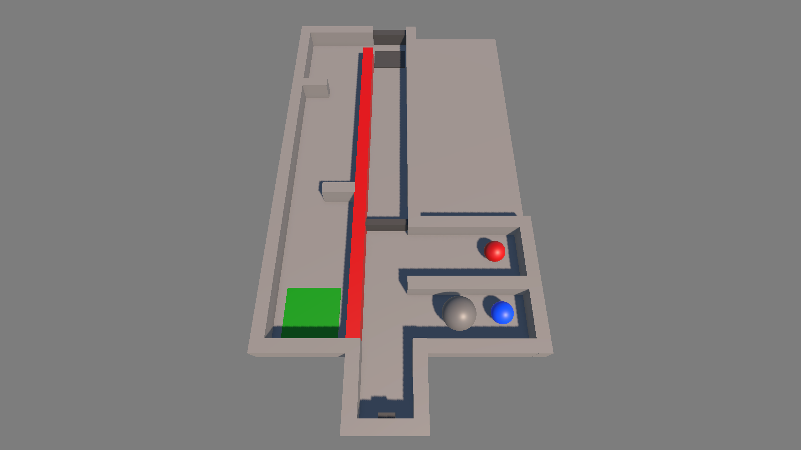

# 🧩 Puzzle Floor
- A small 3D puzzle game made with Unity  
- You can play it in your browser right here: [itch.io/puzzle-floor](https://filiprian.itch.io/puzzle-floor)

## 🤔 Why Did I Make This?
- I wanted a small first project in Unity that wasn't based on tutorials, but rather on my own ideas and skills  
- I enjoy making games

## 🛠️ Main Features
- Rotating platform to guide a blue ball into the goal (green zone)  
- The blue ball and the goal cannot touch red surfaces  
- The gray ball is your friend, and can open doors for you  

## 🎮 Controls
- **WSAD / Arrow Keys** – Rotate the platform  
- **R** – Switch camera angle  
- **X** – Reset the level  
- **Esc** – Pause the game

## 🖼️ Level Screenshot

## ⚙️ Tech Stack
- Engine: Unity  
- Language: C#  
- Tools: Blender  
- Version Control: GitHub  

## 🔮 Future Plans
- More levels with additional features  
- Difficulty settings  

## 🤝 Contributing
Feel free to download this project and modify it however you like (maybe add new levels?)

## 🙏 Credits
Thanks to FreeSound.org for providing free music and sound effects for this game:  
- [freesound](https://freesound.org/)

## 👨‍💻 Author
- Filiprian  
- [My GitHub](https://github.com/Filiprian)

> Making this game was really fun and I learned a lot about collisions and game development.
